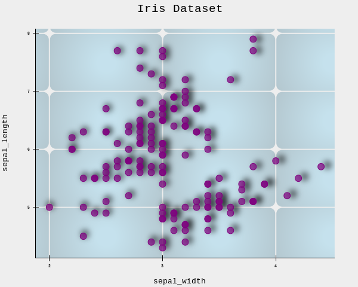

# **Block Grid**

The `block_grid()` method adds a decorative grid of rounded rectangles inside the plotting area. The grid is drawn at the intersections of axis ticks, creating a visually appealing background for your data.

## Basic Usage

```python
import reyplot as rp

df = rp.load_dataset("iris")
fig = rp.chart()
fig.scatter(data=df, x="sepal_width", y="sepal_length")
fig.block_grid()   
fig.show()

``` 

