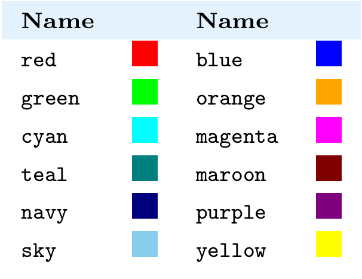

# **Colors in ReyPlot**

ReyPlot provides flexible color handling. You can use **named colors**, **hex codes**, and **automatic cycling**. Colors can also be **mapped** to data columns for gradients.

---

## **Named Colors**

ReyPlot recognizes the following case‑insensitive color names:

| Name | Hex | Name | Hex |
|------|-----|------|-----|
| `red` | `#ff0000` | `blue` | `#0000ff` |
| `green` | `#00ff00` | `white` | `#ffffff` |
| `black` | `#000000` | `gray` / `grey` | `#808080` |
| `orange` | `#ffa500` | `yellow` | `#ffff00` |
| `purple` | `#800080` | `cyan` | `#00ffff` |
| `magenta` | `#ff00ff` | `sky` / `skyblue` | `#87ceeb` |
| `teal` | `#008080` | `maroon` | `#800000` |
| `navy` | `#000080` |

---



**Example:**
```python
fig.scatter(x=[1,2,3], y=[4,5,6], color="teal")
```
