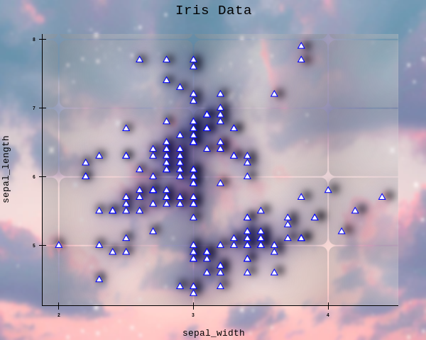
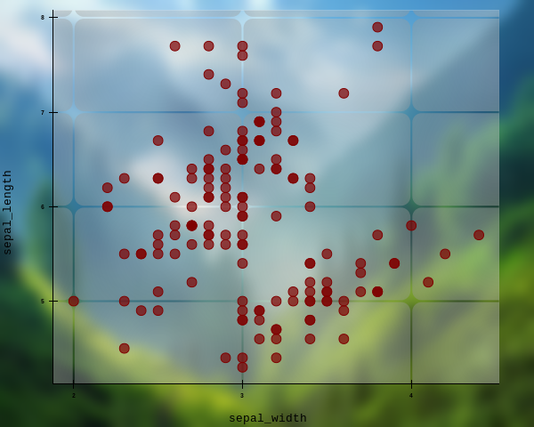
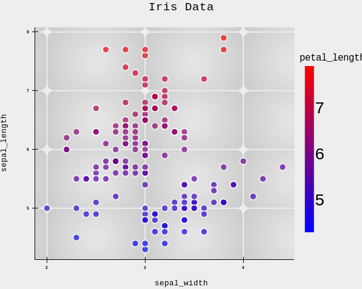
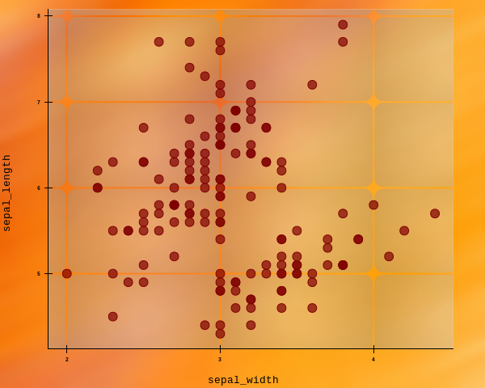
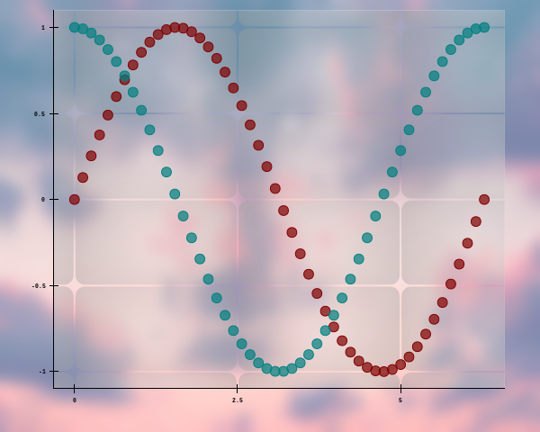

# **ReyPlot**

ReyPlot is a lightweight **2D scientific** plotting library built in Python. It combines the flexibility of **low‑level graphics** with the simplicity of high‑level APIs, enabling you to create stunning visualizations in just a few lines of code. Whether you need a quick scatter plot for data exploration or a publication‑ready figure with gradients, glows, and shadows, ReyPlot gives you the tools without the complexity.

---

## Why ReyPlot?

- **Minimal Code** – Create a chart with a single function call.
- **Rich Styling** – Apply gradients, glows, shadows, and custom dot shapes effortlessly.
- **Data Agnostic** – Works with Polars, Pandas, NumPy, Arrow, and native Python structures.
- **Layer‑Based Rendering** – Fine control over every element of your figure.
- **High Performance** – Built on Cairo for vector graphics and Polars for data processing.
- **Export Ready** – Save plots as PNG, JPG, or SVG with one command.

---
<div class="grid cards" markdown>

{ width="250" }
{ width="250" }
{ width="250" }
{ width="250" }
{ width="250" }
{ width="250" }

</div>

## **Core Features**

## 1. Scatter Plots with Advanced Mapping
ReyPlot’s `scatter()` method does much more than draw points. You can encode additional dimensions using color and size mapping.

```python
fig.scatter(
    data=df,
    x="sepal_width",
    y="sepal_length",
    color_by="petal_length",
    color_range=("cyan", "maroon"),
    size_by="petal_width",
    size_range=(1, 3),                
    glow=True,
    shadow=True                 
)
``` 

## **Quick Example**

```python

import reyplot.plot as rlt
# Import polars for direct data loading
import polars as pl 

``` 
 

## **1. Load the iris dataset using polars from a public URL**

```python 

df = pl.read_csv("https://raw.githubusercontent.com/mwaskom/seaborn-data/master/iris.csv")

rlt.chart(size=[600,480])

rlt.scatter(data = df,
           x = "sepal_width",
           y = "sepal_length",
           color_by = "sepal_length",
           color_range = ("blue","red")
           )
rlt.title("Iris Data")
rlt.save("iris_scatter_plot.png")

```

## **2. Layer‑Based Architecture**
ReyPlot organizes plots into layers, drawn in a fixed order:

1. **Inner Layer** – background inside the axes.

2. **Background Image** – optional image behind the plot.

3. **Block Grid** – decorative grid of rounded rectangles.

4. **Outer Layer** – background outside the axes (with a cutout for the inner area).

5. **Scatter Points** – your data.

6. **Axes** – axes lines, ticks, and tick labels.

7. **Titles** – main title and axis labels.

8. **Legend** – legend for multiple datasets or mappings.

Each layer is customizable with **colors**, **gradients**, and **transparency.**


## **3. Glow, Shadow, and Gradients**

**Glow** – creates a radiant halo around points.

**Shadow** – casts a soft shadow, adding depth.

**Gradients** – radial gradients for inner/outer layers and block grid.

## **4. Background Images**
Place any image behind your plot, optionally blurred, for creative backgrounds.

```python
fig.background_image(path="forest.jpg", blur=5)
```

## **5.Intelligent Axes**

Axes are automatically scaled with nice tick positions using the Wilkinson algorithm. You can override limits, change style (L‑shape or boxed), and control tick count and label precision.

```python
fig.axes(color="black", style="boxed", x_tic=5, y_tic=5, sig_digits=3)
```

## **6. Legend & Auto‑Legend**
Create a legend manually by providing a title to each scatter trace, or let ReyPlot generate a color bar or size bar automatically when using color_by or size_by.

```python
fig.legend(location="top_right", shadow=True)
fig.auto_legend(style="formal")
```

## **7. Architecture Overview**
ReyPlot is built on three core technologies:

**Cairo** – a 2D graphics library that provides high‑quality vector and raster output.

**Polars** – a fast DataFrame library that handles data conversion and processing.

**Pillow** – for image loading, resizing, and blurring.

This stack ensures that plots are rendered with crisp lines, correct alpha blending, and support for both pixel‑perfect ```(PNG, JPG)``` and resolution‑independent ```(SVG)``` outputs.

## **Community & Contribution**
ReyPlot is under active development. We welcome contributions, bug reports, and feature requests.

**GitHub Repository:**  [MuhammadEssa2002/reyplot](https://github.com/MuhammadEssa2002/reyplot")

**Issues:** For any question or Report a bug or request a feature.reach out at
[essabahootraza@gmail.com](mailto:essabahootraza@gmail.com)

**License:** BSD 3‑Clause


## **Contributors**

- **Muhammad Essa** – Library developer
- **Sunbal Shehzadi** – Documentation (content writing, and structuring)

[SunbalShehzadi](https://github.com/SUNBALSHEHZADI/reyplotdocuments)
