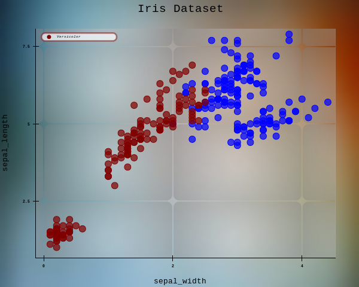

# **Legend**

You can add a legend to identify different datasets or mapped colors/sizes.

## **Enabling Legend**

By default, the legend is **disabled**. Enable it with:

```python
fig.legend()
```

```python
fig.legend(location="top_left")

```

```python
fig.legend(display=True,
location="top_right",
text_color="black", stroke=True,
stroke_color=None, shadow=False)
```

