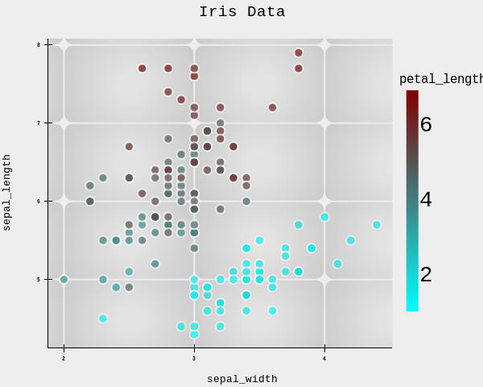

# **Scatter Plots**

The `scatter()` method is the core plotting function. It adds points to your chart and provides extensive customization options, from basic color and size to advanced mapping and visual effects.

## **Basic Usage**

### **With Raw Lists**

```python
fig.scatter(x=[1,2,3,4], y=[10,20,15,25], color="blue", size=1)
``` 
## **With a DataFrame**
```python
fig.scatter(data=df, x="col1", y="col2", color="teal")

```
When you provide a DataFrame, x and y are column names. The data argument accepts Polars, Pandas, NumPy, Arrow, or any convertible format.


### **Parameters**

| Parameter | Type | Description |
|-----------|------|-------------|
| `x` | str or list | Column name or list of numbers |
| `y` | str or list | Column name or list of numbers |
| `data` | any convertible type | Data source (optional if x,y are lists) |
| `color` | str | Color name or hex (default: auto‑cycled) |
| `size` | float | Base dot size multiplier (default 1) |
| `alpha` | float | Opacity (0‑1) (default 0.7) |
| `stroke` | bool | Whether to outline points (default True) |
| `stroke_size` | float | Outline thickness (default 1) |
| `glow` | bool | Add glow effect (default False) |
| `shadow` | bool | Add shadow (default False) |
| `shadow_radius` | float | Shadow blur radius (default 1) |
| `title` | str | Label for legend (if you add multiple scatters) |
| `color_by` | str | Column name to map point colors |
| `color_range` | tuple | Two colors (hex/names) for min/max mapping |
| `size_by` | str | Column name to map point sizes |
| `size_range` | tuple | (min_size, max_size) multipliers (default (1,2)) |


## **Dot Shapes**
ReyPlot offers a variety of marker shapes. The following examples use the Iris dataset with the same style but different dot shapes.


## **data**

The `data` parameter accepts a `DataFrame` from **Polars** or **Pandas**.  
It is used to initialize the dataset for ReyPlot.

```python
chrt.scatter(data=data_set, x="sepal_width", y="petal_width")
```

Here, `data_set` is a **Polars DataFrame** containing the Iris dataset.


## **x and y**

`x` and `y` can take:

- a **string** representing a column name (when `data` is provided), or  
- a **list**, **NumPy array**, or **Polars Series** (when `data` is not provided).

**Example 1 — Using column names**

```python
data_set = rp.load_dataset("iris")

chrt = rp.chart()
chrt.scatter(data=data_set, x="sepal_width", y="petal_width")
```



**Example 2 — Using raw numeric data**

```python
x = np.linspace(0, 2*np.pi, 50)
y1 = np.sin(x)
y2 = np.cos(x)

chrt = rp.chart()
chrt.scatter(x=x, y=y1)
chrt.scatter(x=x, y=y2)
chrt.background_image(path="image", blur=7)
```


## **color**

The `color` parameter accepts:

- a **color name** (e.g., `"red"`, `"sky"`, `"teal"`), or  
- a **hex code** (e.g., `"#00AFDB"`).

If not provided, ReyPlot automatically assigns a color.

```python
chrt.scatter(x=x, y=y1, color="red")
chrt.scatter(x=x, y=y2, color="#00AFDB")
```


## **size**

Controls the marker size.  
Takes a positive `float`.  
Default value: **1**.

```python
chrt.scatter(x=x, y=y, size=2)
```


## **alpha**

Controls the opacity of the scatter points.  
Takes a `float` between **0 and 1**.  
Default value: **0.7**.

```python
chrt.scatter(x=x, y=y, alpha=0.5)
```


## **stroke**

Enables or disables the marker edge (outline).  
Takes a `bool`.  
Default value: **True**.

```python
chrt.scatter(x=x, y=y, stroke=False)
```


## **stroke_size**

Controls the thickness of the marker edge.  
Takes a positive `float`.  
Default value: **1**.

```python
chrt.scatter(x=x, y=y, stroke_size=2)
```


## **glow**

Enables a glow effect around the scatter points.  
Takes a `bool`.  
Default value: **False**.

```python
chrt.scatter(x=x, y=y, glow=True)
```


## **shadow**

Enables a shadow effect under the scatter points.  
Takes a `bool`.  
Default value: **False**.

```python
chrt.scatter(x=x, y=y, shadow=True)
```


## **shadow_radius**

Controls the radius of the shadow blur.  
Takes a positive `float`.  
Default value: **1**.

```python
chrt.scatter(x=x, y=y, shadow=True, shadow_radius=0.5)
```
